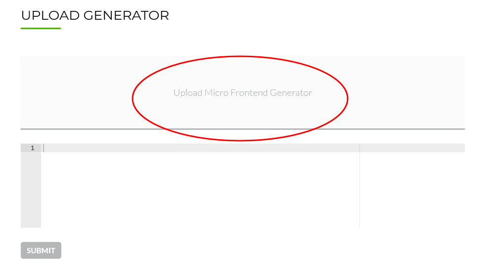

# piral-cloud-sample-generators

A set of generators for the Piral Cloud Feed Service to be inspired and learn from.

## General Structure

A generator is just a Node.js module that exports a certain interface. To produce a single Node.js module you can use a bundler like esbuild.

From the command line you can then use:

```sh
esbuild src/index.ts --bundle --format=cjs --platform=node --target=node16 --outdir=dist
```

This will generate a file "index.js" in the `dist` folder. The `src/index.ts` file (and associated imports) are taken as input to produce that file.

The following exports are expected:

- `name` (`string`): The name of the generator
- `version` (`string`): The version of the generator
- `description` (`string`): The description of the generator
- `author` (`string`): The author of the generator
- `extension` (`string`): The extension of the generated file (default is `.tgz`)
- `link` (`string`): The link to the author's or generator's website ("more infos")
- `icon` (`string`): The icon to be used for the generator; must be a valid source (can be also a data / base64 URL)
- `steps` (`array`): The input expected by the generator - this is used in the UI to show the fields, but also for the API to make a pre-validation
- `validate` (`function` returning a `Promise<boolean>`): Custom validation function receiving the input data that exceed the standard format described in the `steps`
- `generate` (`function` returning a `Promise<Buffer>`): Function that is called with the input data when the generator should actually generate something

Each step item consists of `name`, `description`, and `value` fields, where the specific shape of `value` depends on the `type` field therein.

Examples:

```ts
export const steps = [
  {
    name: 'name',
    description: 'The name of the pilet.',
    value: {
      type: 'string',
      default: 'sample-pilet',
      example: '@org/foo',
    },
  },
  {
    name: 'pages',
    description: 'The number of sample pages to include in the pilet.',
    value: {
      type: 'number',
      default: 1,
      example: 15,
    },
  },
  {
    name: 'useReact',
    description: 'Indicates if React should be used. If not the pilet will fall back to HTML.',
    value: {
      type: 'boolean',
      default: true,
      example: false,
    },
  },
  {
    name: 'features',
    description: 'Indicates what features should be used.',
    value: {
      type: 'multi',
      schema: {
        type: 'enum',
        choices: ['menu', 'notification', 'dashboard'],
        default: 'menu',
        example: 'dashboard',
      },
      minimum: 0,
      maximum: 3,
    },
  },
];
```

For completeness, the type definition for a step object is:

```ts
export interface GeneratorStep {
  name: string;
  description: string;
  value: GeneratorStepValue;
}

export type GeneratorStepValue =
  | GeneratorSingleStep
  | GeneratorMultiStep;

export type GeneratorSingleStep =
  | GeneratorStringStep
  | GeneratorBooleanStep
  | GeneratorNumberStep
  | GeneratorEnumStep;

export interface GeneratorStringStep {
  type: 'string';
  default?: string;
  example?: string;
}

export interface GeneratorBooleanStep {
  type: 'boolean';
  default?: boolean;
  example?: boolean;
}

export interface GeneratorNumberStep {
  type: 'number';
  default?: number;
  example?: number;
}

export interface GeneratorEnumStep {
  type: 'enum';
  choices: Array<string>;
  default?: string;
  example?: string;
}

export interface GeneratorMultiStep {
  type: 'multi';
  schema: GeneratorSingleStep;
  default?: Array<string | boolean | number>;
  example?: Array<string | boolean | number>;
  minimum?: number;
  maximum?: number;
}
```

The job of the `generate` function is to provide a valid package that can be downloaded after the job is done. The expectation is that this is a tgz file, but as this is not binary checked any format will suffice.

Note: If you use a different type or format then it makes sense to also export explicitly the `extension`, which - by default - is set to `.tgz`.

You can use the following boilerplate to create a tgz file:

```ts
import { pack } from 'tar-stream';
import { constants, createGzip } from 'zlib';

async function createPackage(files: Record<string, Buffer>) {
  const tar = pack();
  const gzipStream = createGzip({ level: constants.Z_BEST_COMPRESSION });
  const buffers: Array<Buffer> = [];

  Object.entries(files).forEach(([name, content]) => {
    tar.entry({ name }, content);
  });

  tar.finalize();

  for await (const data of tar.pipe(gzipStream)) {
    buffers.push(data);
  }

  return Buffer.concat(buffers);
}

interface Data {
  //TODO - fill with your input data determined by `steps`
}

export async function generate(input: Data) {
  const files: Record<string, Buffer> = {};

  //TODO - generate these entries

  return await createPackage(files);
}
```

## Templating

In the first two examples, `simple` and `steps` you'll see how files are added using simple inline templating such as

```js
  files['tsconfig.json'] = createJsonFile({
    compilerOptions: {
      declaration: true,
      noImplicitAny: false,
      removeComments: false,
      noLib: false,
      emitDecoratorMetadata: true,
      experimentalDecorators: true,
      target: 'es6',
      sourceMap: true,
      outDir: './dist',
      skipLibCheck: true,
      lib: ['dom', 'es2018'],
      moduleResolution: 'node',
      module: 'esnext',
      jsx: 'react',
      importHelpers: true,
    },
    include: ['src'],
    exclude: ['node_modules'],
  });
```

for a JSON file or

```js
files['src/index.tsx'] = createTextFile(`import { PiletApi } from ${JSON.stringify(appShell)};
${importCode.join('\n')}
  
export function setup(api: PiletApi) {
  ${pagesCode.join('\n  ')}
}
`);
```

for a text / source file. If your files get more complicated than choosing a dedicated templating engine might be better. One example for such a templating engine is "EJS", which you can find at [ejs.co/](https://ejs.co/). Once installed it allows you to write files like:

```js
import { PiletApi } from "<%= appShell %>";
  
export function setup(api: PiletApi) {}
```

Preferably, you should use some kind of convention to distinguish EJS files from others - for instance by using the `.ejs` extension, e.g., `index.tsx.ejs` for an EJS template of the `index.tsx` file. Within a file you can then use the variables (such as `appShell`) from the input. The special notation, such as `<%= ... %>` is the EJS syntax that you'd need to use.

Importantly, as you need to have a single module you want to have a setup like this:

```ts
// import EJS
import { render } from 'ejs';

// import the file; see later
import indexTsxTemplate from './index.tsx.ejs';

interface Data {
  // your input data shape
}

// your standard generate function, but using the template system now
export async function generate(input: Data) {
  const files: Record<string, Buffer> = {};

  files['src/index.tsx'] = createFile(indexTsxTemplate, input);

  return await createPackage(files);
}

// creates a buffer by filling out the template using the input data
function createFile(template: string, input: Data): Buffer {
  const source = render(template, input);
  return Buffer.from(source, 'utf8');
}
```

You'll need to instruct your bundler to transform EJS imports into standard text. With esbuild this could look as follows:

```sh
esbuild src/index.ts --bundle --format=cjs --platform=node --target=node16 --outdir=dist --loader:.ejs=text
```

## Adding a Generator

Once you created a generator you will need to add (or integrate) it in the feed service.

You start in the admin / manage area of the feed service. Clicking on "MF Generators" will bring you to a screen where all available generators are shown. In the screen click oN "Add new generator".


Now you can either create a generator from scratch or upload a new one. Usually, you want to upload a new one - generators tend to get quite complex and using the text field is not recommended here.

Select a created generator and upload it. This should be a JS file.



You have the chance of changing the content of the selected generator, but usually you'll dismiss this chance here; just submit.


Everything should be uploaded now - this means the generator appears in the list.


Great - you've just added a new generator to your Piral Feed Service instance!

## Using a Generator

Every generator is available for all feeds. When you have write rights on a feed (as every contributor has), you'll have the option to "Generate Micro Frontend".


Clicking on the generate micro frontend action will give you a list of available generators. Click on one (usually, you choose the one that generates teh code you are looking for) to get started.


After entering all values you'll see a summary of the input to be used. You can either edit one of these entries or go ahead by submitting.


Once submitted the feed service processes the input against the chosen generator. At the end the final binary will be uploaded and the download link will be provided.


Note that the whole process can be automated, too. The API has a function to provide a set of inputs, which triggers the generator. The result of the API call is the URL to the generated file. Therefore, it is possible to use the generator within your existing system to fully scaffold a micro frontend.
